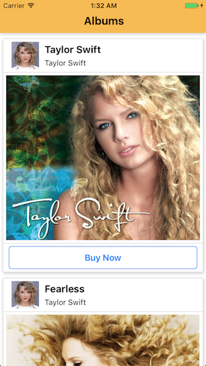
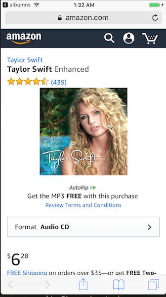

# Introduction
This project is a basic example app for React Native. It covers React Native's functional and class components, styling, making HTTP requests, images, buttons and linking.

Albums are retrieved via a HTTP GET request and displayed as a ScrollView to user.

Users can click on the 'Buy Now' button which will take them to Amazon to purchase the album.

